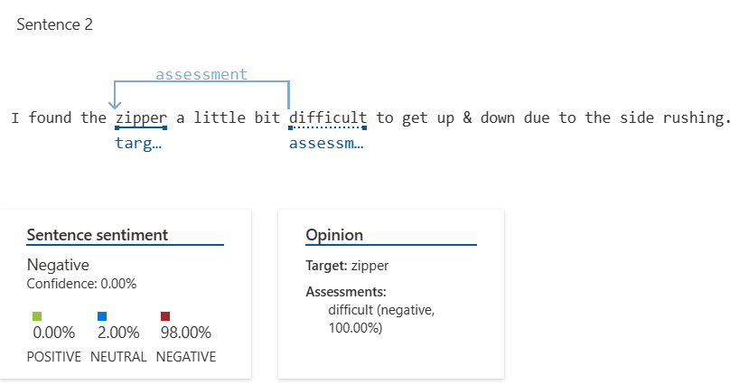

# Analise de Sentimentos e opiniões do Azure
O recurso Análise de Sentimento da API de Análise de Texto fornece rótulos de sentimento (como "negativo", "neutro" e "positivo") e scores de confiança na sentença e nível de documento. Você também pode enviar solicitações de Mineração de Opinião usando o ponto de extremidade Análise de Sentimento, que fornece informações granulares sobre as opiniões relacionadas às palavras (como os atributos de produtos ou serviços) no texto. [Saiba mais](https://learn.microsoft.com/pt-br/azure/ai-services/language-service/sentiment-opinion-mining/overview?tabs=prebuilt)

Siga com alguns prints de exemplo:

#### Visão Geral

#### Sentença 1

#### Sentença 2

#### Sentença 3

#### Sentença 4

-
Este é um recurso muito útil para filtragem de dados baseado em sua analise de sentimentos e opinião, tornado mais simples uma tárefa que poderia levar muito tempo para ser concluída (dependendo do cenário).
